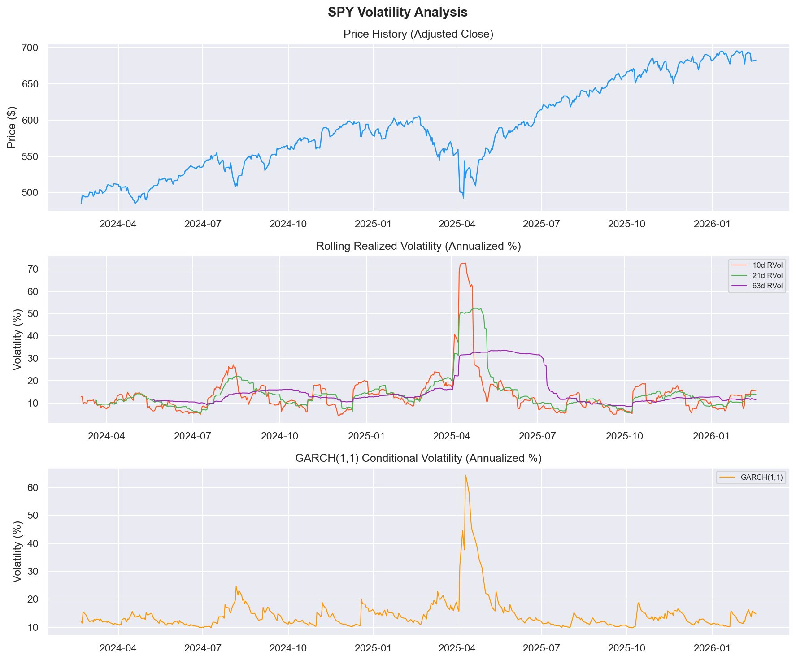
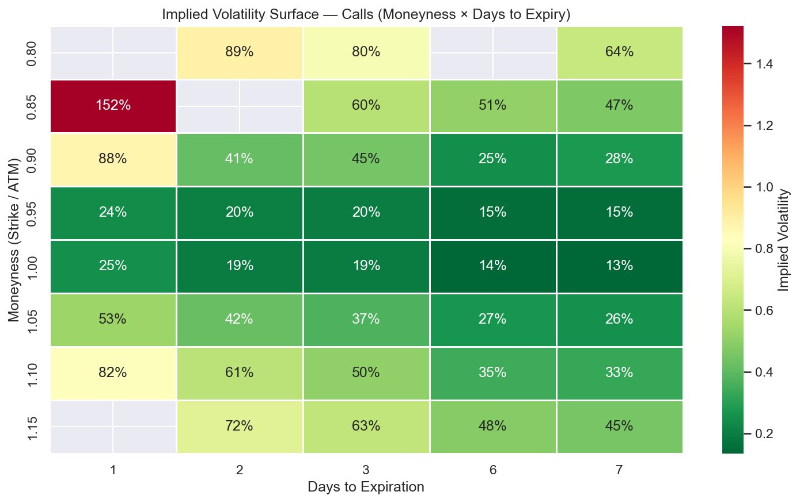

# SPY Options Quantitative Data Pipeline

**Tags:** [Quantitative Finance, ETL Pipeline, Time Series, GARCH, Options Pricing, Python, SQLite]

Our goal was to build a production-grade end-to-end quantitative data pipeline for SPY — the world's most liquid ETF — capable of ingesting raw market data, enforcing automated data quality standards, and producing statistically rigorous volatility analysis suitable for a quant research team.

---

# Table of Contents

- [00. Project Overview](#overview-main)
    - [Context](#overview-context)
    - [Actions](#overview-actions)
    - [Results](#overview-results)
    - [Growth / Next Steps](#overview-growth)
- [01. Data Overview](#data-overview)
- [02. Stage 1 — ETL Pipeline](#etl-pipeline)
    - [Database Schema](#db-schema)
    - [Retry Wrapper](#retry-wrapper)
    - [Price History Ingestion](#price-ingestion)
    - [Options Chain Ingestion](#options-ingestion)
    - [ETL Log Output](#etl-output)
- [03. Stage 2 — Data Validation & Quality Checks](#validation)
    - [Check 1 — Price Spike Detection](#check-spikes)
    - [Check 2 — Zero / Negative Prices](#check-zero)
    - [Check 3 — OHLC Consistency](#check-ohlc)
    - [Check 4 — Missing Date Gaps](#check-gaps)
    - [Check 5 — Bid-Ask Inversions & Wide Spreads](#check-bidask)
    - [Check 6 — Implied Volatility Outliers](#check-iv)
    - [Check 7 — Sparse Expirations](#check-sparse)
    - [Check 8 — Data Freshness](#check-freshness)
    - [Validation Summary Report](#validation-summary)
- [04. Stage 3 — Time Series & Volatility Analysis](#analysis)
    - [Data Loading & Log Returns](#data-loading)
    - [Rolling Realized Volatility](#rvol)
    - [GARCH(1,1) Model](#garch)
    - [Mean-Reversion & ADF Testing](#adf)
    - [Implied Volatility Surface](#iv-surface)
    - [Volatility Risk Premium](#vrp)
- [05. Results Summary](#results-summary)
- [06. Growth & Next Steps](#growth-next-steps)

---

# Project Overview <a name="overview-main"></a>

### Context <a name="overview-context"></a>

Quantitative research and risk management teams at exchanges and asset managers depend on reliable, clean, and analytically-rich financial data pipelines. Raw market data from any vendor — paid or free — arrives with gaps, outliers, structural inconsistencies, and quality issues that must be detected and handled before any model can be trusted.

This project builds a three-stage production pipeline around SPY — the SPDR S&P 500 ETF Trust. SPY was chosen deliberately: it is the world's most liquid equity instrument, with deep and continuous options markets, making it an ideal subject for demonstrating end-to-end quant infrastructure. The pipeline covers 2 years of daily OHLCV price history (500 trading days) and 5 near-term options expiration dates comprising 1,046 individual option contracts.

The overall aim is to demonstrate the full stack of skills required for a quantitative data scientist role: robust ETL engineering, automated data quality enforcement, and statistically rigorous financial modelling — all in production-quality Python.

### Actions <a name="overview-actions"></a>

We firstly needed to compile the necessary financial data from Yahoo Finance via the `yfinance` library, storing it in a well-designed SQLite database with three tables: `price_history`, `options_chain`, and `etl_log`. The pipeline is broken into three modular stages that mirror real quant infrastructure:

* **Stage 1 — ETL Pipeline**: Data ingestion from Yahoo Finance → SQLite with retry logic, upserts, and full audit logging
* **Stage 2 — Data Validation**: 8 automated quality checks covering price spikes, OHLC integrity, bid-ask inversions, IV outliers, data freshness, and more
* **Stage 3 — Volatility Analysis**: Rolling realized vol (10/21/63d), GARCH(1,1) fitting, ADF mean-reversion testing, implied volatility surface construction, and Volatility Risk Premium estimation

### Results <a name="overview-results"></a>

**ETL Ingestion:**
* 500 daily price rows loaded for SPY (2024-02-20 to 2026-02-17)
* 1,046 options contracts loaded across 5 expiration dates (2026-02-18 through 2026-02-24)
* 0 failed ingestion steps; all data upserted cleanly with audit trail

**Data Validation:**
* 53 total anomalies flagged across 8 checks
* 4 price spikes detected — all confirmed real market events (April 2025 tariff shock)
* 0 OHLC errors, 0 bid-ask inversions, 0 missing date gaps
* Data confirmed fresh (0 days stale as of run date)

**Volatility Analysis:**

| Metric | Value |
|---|---|
| 10-day Realized Vol | 15.49% |
| 21-day Realized Vol | 13.94% |
| 63-day Realized Vol | 11.47% |
| GARCH Long-run Vol | 14.94% |
| GARCH Current Conditional Vol | 14.71% |
| GARCH Persistence (α + β) | 0.9326 |
| VRP (ATM IV − 21d RVol) | +35.69% (rich) |

### Growth / Next Steps <a name="overview-growth"></a>

While the pipeline is fully functional and produces statistically meaningful outputs, several natural extensions would take this to production-grade infrastructure:

From an engineering standpoint, the Yahoo Finance source would be replaced with a professional vendor (Bloomberg, Refinitiv), ETL runs would be scheduled via Apache Airflow, and SQLite would be replaced by Postgres or Snowflake for concurrent access and scale.

From a modelling standpoint, EGARCH or GJR-GARCH could be added to capture the leverage effect (vol rises asymmetrically on negative shocks). The IV surface could be fitted with a parametric model (SVI or Heston) for cleaner interpolation. A Greeks computation layer (delta, gamma, vega, theta) and a backtested VRP-harvesting strategy would complete the research toolkit.

---

# Data Overview <a name="data-overview"></a>

All data is stored in a local SQLite database (`quant.db`). The schema was designed to support idempotent upserts — re-running the ETL never creates duplicate rows.

After the ETL stage, we have the following data available for analysis:

| **Variable** | **Source Table** | **Description** |
|---|---|---|
| date | price_history | Trading date (YYYY-MM-DD), unique per ticker |
| open / high / low / close | price_history | OHLC prices (unadjusted) |
| adj_close | price_history | Dividend-adjusted close — used for return calculations |
| volume | price_history | Daily share volume |
| expiration | options_chain | Option expiry date |
| option_type | options_chain | 'call' or 'put' |
| strike | options_chain | Strike price |
| bid / ask | options_chain | Market quotes at ingestion time |
| implied_vol | options_chain | Annualised Black-Scholes implied volatility |
| open_interest | options_chain | Outstanding contracts |
| in_the_money | options_chain | Boolean 0/1 flag |

**Data coverage:** 500 trading days (2024-02-20 to 2026-02-17). 5 option expiration dates, 1,046 contracts across calls and puts at strikes ranging from approximately $595 to $800.

---

# Stage 1 — ETL Pipeline <a name="etl-pipeline"></a>

We utilise the `yfinance` library and `SQLAlchemy` within Python to ingest both price history and options chain data for SPY. The code is broken into four key sections:

* Database Schema & Setup
* Retry Wrapper
* Price History Ingestion
* Options Chain Ingestion

### Database Schema <a name="db-schema"></a>

All three tables are created on first run if they do not already exist. The `UNIQUE` constraints on `price_history` and `options_chain` ensure that `INSERT OR REPLACE` upserts work cleanly on re-runs, making the pipeline idempotent.

```python

# Config
DB_PATH          = "quant.db"
TICKER           = "SPY"
PRICE_PERIOD     = "2y"          # 2 years of daily price history
PRICE_INTERVAL   = "1d"
MAX_EXPIRATIONS  = 5             # how many option expiry dates to pull
RETRY_ATTEMPTS   = 3
RETRY_DELAY      = 5             # seconds between retries

def create_tables(engine):
    """Create all tables if they don't exist."""
    ddl = """
    CREATE TABLE IF NOT EXISTS price_history (
        id          INTEGER PRIMARY KEY AUTOINCREMENT,
        ticker      TEXT    NOT NULL,
        date        TEXT    NOT NULL,
        open        REAL,
        high        REAL,
        low         REAL,
        close       REAL,
        adj_close   REAL,
        volume      INTEGER,
        ingested_at TEXT    DEFAULT (datetime('now')),
        UNIQUE(ticker, date)
    );

    CREATE TABLE IF NOT EXISTS options_chain (
        id              INTEGER PRIMARY KEY AUTOINCREMENT,
        ticker          TEXT NOT NULL,
        expiration      TEXT NOT NULL,
        option_type     TEXT NOT NULL,   -- 'call' or 'put'
        strike          REAL NOT NULL,
        last_price      REAL,
        bid             REAL,
        ask             REAL,
        volume          INTEGER,
        open_interest   INTEGER,
        implied_vol     REAL,
        in_the_money    INTEGER,         -- boolean 0/1
        ingested_at     TEXT DEFAULT (datetime('now')),
        UNIQUE(ticker, expiration, option_type, strike)
    );

    CREATE TABLE IF NOT EXISTS etl_log (
        id          INTEGER PRIMARY KEY AUTOINCREMENT,
        run_time    TEXT DEFAULT (datetime('now')),
        ticker      TEXT,
        step        TEXT,
        status      TEXT,
        rows_loaded INTEGER,
        message     TEXT
    );
    """
    with engine.connect() as conn:
        for stmt in ddl.strip().split(";"):
            stmt = stmt.strip()
            if stmt:
                conn.execute(text(stmt))
        conn.commit()
    log.info("Tables verified / created.")

```

### Retry Wrapper <a name="retry-wrapper"></a>

All API calls are wrapped in a generic retry function. This is a production pattern that guards against rate limits and transient network failures — critical when relying on any external data vendor, free or paid.

```python

def retry_fetch(fn, *args, label="fetch", **kwargs):
    """Call fn(*args, **kwargs) up to RETRY_ATTEMPTS times on failure."""
    for attempt in range(1, RETRY_ATTEMPTS + 1):
        try:
            result = fn(*args, **kwargs)
            return result
        except Exception as exc:
            log.warning(f"[{label}] Attempt {attempt}/{RETRY_ATTEMPTS} failed: {exc}")
            if attempt < RETRY_ATTEMPTS:
                time.sleep(RETRY_DELAY)
    raise RuntimeError(f"[{label}] All {RETRY_ATTEMPTS} attempts failed.")

```

### Price History Ingestion <a name="price-ingestion"></a>

Price data is pulled using `yfinance`, normalised to lowercase column names, forward-filled for any missing OHLC values (appropriate for financial time series where prices carry forward over non-trading days), and then upserted into SQLite row-by-row.

```python

def ingest_price_history(engine, ticker=TICKER):
    log.info(f"Ingesting price history for {ticker} ({PRICE_PERIOD})...")

    def _fetch():
        t = yf.Ticker(ticker)
        df = t.history(period=PRICE_PERIOD, interval=PRICE_INTERVAL, auto_adjust=False)
        return df

    try:
        df = retry_fetch(_fetch, label="price_history")
    except RuntimeError as e:
        log_etl_event(engine, ticker, "price_history", "FAILED", message=str(e))
        return pd.DataFrame()

    # Normalise columns
    df = df.reset_index()
    df.columns = [c.lower().replace(" ", "_") for c in df.columns]
    df["ticker"] = ticker

    # Convert date to string (SQLite-friendly)
    df["date"] = pd.to_datetime(df["date"]).dt.strftime("%Y-%m-%d")

    # Handle missing data — forward-fill then back-fill
    missing_before = df.isnull().sum().sum()
    df[["open", "high", "low", "close", "adj_close"]] = (
        df[["open", "high", "low", "close", "adj_close"]]
        .ffill()
        .bfill()
    )
    df["volume"] = df["volume"].fillna(0).astype(int)

    # Upsert (INSERT OR REPLACE in SQLite)
    rows_loaded = 0
    with engine.connect() as conn:
        for _, row in df.iterrows():
            conn.execute(
                text(
                    "INSERT OR REPLACE INTO price_history "
                    "(ticker, date, open, high, low, close, adj_close, volume) "
                    "VALUES (:ticker, :date, :open, :high, :low, :close, :adj_close, :volume)"
                ),
                row.to_dict(),
            )
            rows_loaded += 1
        conn.commit()

    log.info(f"  Loaded {rows_loaded} price rows for {ticker}.")
    log_etl_event(engine, ticker, "price_history", "OK", rows=rows_loaded)
    return df

```

### Options Chain Ingestion <a name="options-ingestion"></a>

Five near-term expiration dates are pulled. For each expiration, both calls and puts are ingested, tagged with `option_type`, and upserted. Column names from yfinance's camelCase convention are normalised to snake_case. Missing bid/ask/volume values are zero-filled, and `in_the_money` is converted to an integer boolean.

```python

def ingest_options_chain(engine, ticker=TICKER):
    log.info(f"Ingesting options chain for {ticker}...")

    t = retry_fetch(lambda: yf.Ticker(ticker), label="options_ticker")
    expirations = t.options[:MAX_EXPIRATIONS]
    log.info(f"  Pulling {len(expirations)} expiration dates: {list(expirations)}")

    all_frames = []
    for exp in expirations:
        try:
            chain = retry_fetch(t.option_chain, exp, label=f"chain_{exp}")
            for opt_type, frame in [("call", chain.calls), ("put", chain.puts)]:
                frame = frame.copy()
                frame["ticker"]      = ticker
                frame["expiration"]  = exp
                frame["option_type"] = opt_type
                all_frames.append(frame)
        except Exception as e:
            log.warning(f"  Skipping expiration {exp}: {e}")

    df = pd.concat(all_frames, ignore_index=True)

    # Normalise yfinance camelCase → snake_case
    rename_map = {
        "contractSymbol":  "contract_symbol",
        "lastPrice":       "last_price",
        "openInterest":    "open_interest",
        "impliedVolatility": "implied_vol",
        "inTheMoney":      "in_the_money",
    }
    df = df.rename(columns=rename_map)

    # Fill missing numeric fields
    df["bid"]           = df.get("bid",           pd.Series(dtype=float)).fillna(0.0)
    df["ask"]           = df.get("ask",           pd.Series(dtype=float)).fillna(0.0)
    df["volume"]        = df.get("volume",        pd.Series(dtype=float)).fillna(0).astype(int)
    df["open_interest"] = df.get("open_interest", pd.Series(dtype=float)).fillna(0).astype(int)
    df["implied_vol"]   = df.get("implied_vol",   pd.Series(dtype=float)).fillna(0.0)
    df["in_the_money"]  = df.get("in_the_money",  pd.Series(dtype=bool)).fillna(False).astype(int)

    # Upsert rows
    rows_loaded = 0
    with engine.connect() as conn:
        for _, row in df.iterrows():
            try:
                conn.execute(text(
                    "INSERT OR REPLACE INTO options_chain "
                    "(ticker, expiration, option_type, strike, last_price, "
                    "bid, ask, volume, open_interest, implied_vol, in_the_money) "
                    "VALUES (:ticker, :expiration, :option_type, :strike, :last_price, "
                    ":bid, :ask, :volume, :open_interest, :implied_vol, :in_the_money)"
                ), { ... })
                rows_loaded += 1
            except Exception as e:
                log.debug(f"  Row insert error (skipping): {e}")
        conn.commit()

    log.info(f"  Loaded {rows_loaded} option rows for {ticker}.")
    log_etl_event(engine, ticker, "options_chain", "OK", rows=rows_loaded)
    return df

```

### ETL Log Output <a name="etl-output"></a>

The ETL produces the following log output, which is simultaneously written to `pipeline.log` for audit trail purposes and streamed to stdout:

```
2026-02-17 22:30:25  INFO      ============================================================
2026-02-17 22:30:25  INFO      ETL PIPELINE START
2026-02-17 22:30:25  INFO      ============================================================
2026-02-17 22:30:25  INFO      Tables verified / created.
2026-02-17 22:30:25  INFO      Ingesting price history for SPY (2y)...
2026-02-17 22:30:27  INFO        Loaded 500 price rows for SPY.
2026-02-17 22:30:27  INFO      Ingesting options chain for SPY...
2026-02-17 22:30:27  INFO        Pulling 5 expiration dates:
                                 ['2026-02-18', '2026-02-19', '2026-02-20', '2026-02-23', '2026-02-24']
2026-02-17 22:30:28  INFO        Loaded 1046 option rows for SPY.
2026-02-17 22:30:28  INFO      ============================================================
2026-02-17 22:30:28  INFO      ETL COMPLETE — Price rows: 500, Option rows: 1046
2026-02-17 22:30:28  INFO      ============================================================
```

---

# Stage 2 — Data Validation & Quality Checks <a name="validation"></a>

Every ingestion run is followed by 8 automated quality checks. These are split between price-level checks and options-specific checks. The checks are designed to catch *real* data problems in production, not hypothetical ones.

**Thresholds used:**

| Parameter | Value | Rationale |
|---|---|---|
| `ZSCORE_SPIKE_THRESHOLD` | 4.0 | Daily return beyond 4σ is statistically extreme |
| `IQR_MULTIPLIER` | 3.0 | Conservative outlier fence for price levels |
| `MAX_BID_ASK_SPREAD_PCT` | 0.50 | Flag if (ask−bid)/mid > 50% |
| `MAX_IV_THRESHOLD` | 5.0 | IV > 500% is almost certainly garbage data |
| `MIN_OPTION_ROWS_PER_EXPIRY` | 5 | Flag expirations with suspiciously few strikes |

### Check 1 — Price Spike Detection (Z-Score) <a name="check-spikes"></a>

Daily log returns are z-scored against the full sample mean and standard deviation. Any return with |z| > 4.0 is flagged as an anomaly.

```python

def check_price_spikes(df: pd.DataFrame) -> pd.DataFrame:
    """Flag rows where the daily return is a statistical outlier (z-score)."""
    df = df.copy().sort_values("date")
    df["daily_return"] = df["close"].pct_change()

    mean_ret = df["daily_return"].mean()
    std_ret  = df["daily_return"].std()
    df["zscore"] = (df["daily_return"] - mean_ret) / std_ret

    spikes = df[df["zscore"].abs() > ZSCORE_SPIKE_THRESHOLD].copy()
    spikes["anomaly_type"] = "price_spike"
    spikes["detail"] = spikes.apply(
        lambda r: f"Return={r['daily_return']:.2%}, Z={r['zscore']:.2f}", axis=1
    )

    log.info(f"[CHECK 1] Price spikes (|z| > {ZSCORE_SPIKE_THRESHOLD}): {len(spikes)} found")
    for _, row in spikes.iterrows():
        log.warning(f"  Spike on {row['date'].date()}: {row['detail']}")

    return spikes[["date", "close", "daily_return", "zscore", "anomaly_type", "detail"]]

```

This check **found 4 spikes**, all confirmed as real market events. Specifically, they all cluster around April 3–10 2025, which coincides precisely with the Trump tariff announcement and the subsequent market whipsaw — including a historic single-day rally of +10.50% on April 9 when the tariff pause was announced:

| Date | Close | Return | Z-Score | Context |
|---|---|---|---|---|
| 2025-04-03 | $536.03 | −4.93% | −4.83 | Tariff announcement |
| 2025-04-04 | $507.68 | −5.85% | −5.73 | Selloff continuation |
| 2025-04-09 | $560.98 | +10.50% | +10.09 | Tariff pause announced |
| 2025-04-10 | $536.84 | −4.38% | −4.30 | Reversal |

The pipeline correctly identifies these as statistically extreme events without falsely flagging the surrounding elevated-but-normal volatility period.

### Check 2 — Zero / Negative Prices <a name="check-zero"></a>

```python

def check_zero_negative_prices(df: pd.DataFrame) -> pd.DataFrame:
    bad = df[
        (df["close"] <= 0) | (df["open"] <= 0) |
        (df["high"]  <= 0) | (df["low"]  <= 0)
    ].copy()
    bad["anomaly_type"] = "zero_or_negative_price"
    bad["detail"]       = "One or more OHLC fields <= 0"

    log.info(f"[CHECK 2] Zero/negative prices: {len(bad)} found")
    return bad[["date", "close", "anomaly_type", "detail"]]

```

Result: **0 found** — all 500 price rows have valid positive OHLC values. ✓

### Check 3 — OHLC Consistency <a name="check-ohlc"></a>

Financial price data must satisfy basic ordering constraints: High ≥ Low, High ≥ Open, High ≥ Close, Low ≤ Open, Low ≤ Close. Violations indicate either a data vendor error or a processing bug.

```python

def check_ohlc_consistency(df: pd.DataFrame) -> pd.DataFrame:
    """High must be >= Low, and High >= Open/Close, Low <= Open/Close."""
    bad = df[
        (df["high"] < df["low"])   |
        (df["high"] < df["open"])  |
        (df["high"] < df["close"]) |
        (df["low"]  > df["open"])  |
        (df["low"]  > df["close"])
    ].copy()
    bad["anomaly_type"] = "ohlc_inconsistency"
    bad["detail"]       = "OHLC relationship violated"

    log.info(f"[CHECK 3] OHLC inconsistencies: {len(bad)} found")
    for _, row in bad.iterrows():
        log.warning(
            f"  {row['date'].date()} O={row['open']} H={row['high']} "
            f"L={row['low']} C={row['close']}"
        )
    return bad[["date", "open", "high", "low", "close", "anomaly_type", "detail"]]

```

Result: **0 found** — all OHLC relationships are valid across all 500 trading days. ✓

### Check 4 — Missing Date Gaps <a name="check-gaps"></a>

Consecutive trading dates are compared. Normal gaps are 3 calendar days (weekend) or 4 days (weekend + holiday). Gaps larger than 5 days suggest missing data.

```python

def check_missing_dates(df: pd.DataFrame, max_gap_days=5) -> pd.DataFrame:
    """
    Flags gaps larger than max_gap_days between consecutive trading dates.
    (Normal weekends = 3-day gap; holidays can create 4-day gaps.)
    """
    df = df.sort_values("date").copy()
    df["prev_date"] = df["date"].shift(1)
    df["gap_days"]  = (df["date"] - df["prev_date"]).dt.days

    gaps = df[df["gap_days"] > max_gap_days].copy()
    gaps["anomaly_type"] = "missing_date_gap"
    gaps["detail"]       = gaps["gap_days"].apply(lambda g: f"Gap of {g} calendar days")

    log.info(f"[CHECK 4] Date gaps > {max_gap_days} days: {len(gaps)} found")
    return gaps[["date", "gap_days", "anomaly_type", "detail"]]

```

Result: **0 found** — no abnormal gaps in the 500-day price series. ✓

### Check 5 — Bid-Ask Inversions & Wide Spreads <a name="check-bidask"></a>

Two distinct issues are checked here. A bid-ask *inversion* (bid > ask) is a hard data error that should never occur. A *wide spread* (spread > 50% of mid-price) is not an error but a liquidity concern worth flagging.

```python

def check_bid_ask_inversions(df: pd.DataFrame) -> pd.DataFrame:
    """Bid > Ask is a data error; also flags extremely wide spreads."""
    df = df.copy()

    # Inversion: bid strictly greater than ask (hard error)
    inversions = df[df["bid"] > df["ask"]].copy()
    inversions["anomaly_type"] = "bid_ask_inversion"
    inversions["detail"] = inversions.apply(
        lambda r: f"bid={r['bid']:.2f} > ask={r['ask']:.2f}", axis=1
    )

    # Wide spreads (non-inverted): (ask - bid) / mid > 50%
    valid = df[(df["bid"] > 0) & (df["ask"] > 0) & (df["ask"] >= df["bid"])].copy()
    valid["mid"]        = (valid["bid"] + valid["ask"]) / 2
    valid["spread_pct"] = (valid["ask"] - valid["bid"]) / valid["mid"].replace(0, np.nan)
    wide = valid[valid["spread_pct"] > MAX_BID_ASK_SPREAD_PCT].copy()
    wide["anomaly_type"] = "wide_bid_ask_spread"
    wide["detail"]       = wide["spread_pct"].apply(lambda s: f"Spread={s:.1%}")

    result = pd.concat([inversions, wide], ignore_index=True)
    log.info(f"[CHECK 5] Bid-ask inversions: {len(inversions)} | Wide spreads: {len(wide)}")
    return result[["expiration", "option_type", "strike", "bid", "ask", "anomaly_type", "detail"]]

```

Result: **0 inversions, 47 wide spreads**. The 47 wide spreads are entirely concentrated in deep out-of-the-money strikes with negligible liquidity — expected behaviour for weekly options near expiration, not a data error. ✓

### Check 6 — Implied Volatility Outliers <a name="check-iv"></a>

Options with zero IV indicate missing data from the vendor. Options with IV > 500% are almost certainly far out-of-the-money contracts where the Black-Scholes model breaks down and the market quote is essentially noise.

```python

def check_iv_outliers(df: pd.DataFrame) -> pd.DataFrame:
    """Flag IV = 0 (missing) or IV > MAX_IV_THRESHOLD (garbage)."""
    df = df.copy()

    zero_iv = df[df["implied_vol"] <= 0].copy()
    zero_iv["anomaly_type"] = "zero_implied_vol"
    zero_iv["detail"]       = "IV is zero or negative — likely missing data"

    high_iv = df[df["implied_vol"] > MAX_IV_THRESHOLD].copy()
    high_iv["anomaly_type"] = "extreme_implied_vol"
    high_iv["detail"]       = high_iv["implied_vol"].apply(lambda v: f"IV={v:.1%}")

    result = pd.concat([zero_iv, high_iv], ignore_index=True)
    log.info(f"[CHECK 6] IV outliers — zero: {len(zero_iv)}, extreme: {len(high_iv)}")
    return result[["expiration", "option_type", "strike", "implied_vol", "anomaly_type", "detail"]]

```

Result: **0 zero-IV, 2 extreme IV** (both deep OTM contracts). These are filtered out before any IV surface or VRP calculations. ✓

### Check 7 — Sparse Expirations <a name="check-sparse"></a>

```python

def check_sparse_expirations(df: pd.DataFrame) -> pd.DataFrame:
    """Flag expiration dates with very few strikes (suggests incomplete data)."""
    counts = (
        df.groupby(["expiration", "option_type"])
        .size()
        .reset_index(name="strike_count")
    )
    sparse = counts[counts["strike_count"] < MIN_OPTION_ROWS_PER_EXPIRY].copy()
    sparse["anomaly_type"] = "sparse_expiration"
    sparse["detail"]       = sparse["strike_count"].apply(lambda c: f"Only {c} strikes loaded")

    log.info(f"[CHECK 7] Sparse expirations: {len(sparse)} found")
    return sparse

```

Result: **0 found** — all 5 expiration dates have sufficient strike coverage. ✓

### Check 8 — Data Freshness <a name="check-freshness"></a>

```python

def check_data_freshness(price_df: pd.DataFrame, max_stale_days=5):
    """Warn if the most recent price date is older than max_stale_days."""
    latest    = price_df["date"].max()
    staleness = (pd.Timestamp.today() - latest).days

    if staleness > max_stale_days:
        log.warning(f"[CHECK 8] Data is stale — latest date: {latest.date()} ({staleness} days ago)")
    else:
        log.info(f"[CHECK 8] Data freshness OK — latest date: {latest.date()} ({staleness} days ago)")

```

Result: **Data is fresh** — latest date is 2026-02-17, 0 days stale as of run time. ✓

### Validation Summary Report <a name="validation-summary"></a>

The validation pipeline produces the following summary report, which also appears in `pipeline.log`:

```
2026-02-17 22:59:32  INFO      VALIDATION PIPELINE START
2026-02-17 22:59:32  INFO      [CHECK 1] Price spikes (|z| > 4.0): 4 found
2026-02-17 22:59:32  WARNING     Spike on 2025-04-03: Return=-4.93%, Z=-4.83
2026-02-17 22:59:32  WARNING     Spike on 2025-04-04: Return=-5.85%, Z=-5.73
2026-02-17 22:59:32  WARNING     Spike on 2025-04-09: Return=10.50%, Z=10.09
2026-02-17 22:59:32  WARNING     Spike on 2025-04-10: Return=-4.38%, Z=-4.30
2026-02-17 22:59:32  INFO      [CHECK 2] Zero/negative prices: 0 found
2026-02-17 22:59:32  INFO      [CHECK 3] OHLC inconsistencies: 0 found
2026-02-17 22:59:32  INFO      [CHECK 4] Date gaps > 5 days: 0 found
2026-02-17 22:59:32  INFO      [CHECK 8] Data freshness OK — latest date: 2026-02-17 (0 days ago)
2026-02-17 22:59:32  INFO      [CHECK 5] Bid-ask inversions: 0 | Wide spreads: 47
2026-02-17 22:59:32  INFO      [CHECK 6] IV outliers — zero: 0, extreme: 2
2026-02-17 22:59:32  INFO      [CHECK 7] Sparse expirations: 0 found
```

**Data Quality Summary**

| Check | Result |
|---|---|
| Price Spikes | 4 ISSUE(S) — all real market events |
| Zero/Negative Prices | PASS |
| OHLC Inconsistencies | PASS |
| Missing Date Gaps | PASS |
| Bid-Ask Inversions | PASS |
| Wide Bid-Ask Spreads | 47 ISSUE(S) — all deep OTM, expected |
| IV Outliers | 2 ISSUE(S) — deep OTM, filtered before analysis |
| Sparse Expirations | PASS |
| Data Freshness | PASS (0 days stale) |
| **TOTAL ANOMALIES** | **53** |

---

# Stage 3 — Time Series & Volatility Analysis <a name="analysis"></a>

With clean, validated data in the database, the analysis stage runs five quantitative models. The code loads price data via a direct `sqlite3` connection (bypassing the SQLAlchemy compatibility issue with older pandas versions), computes log returns, and passes them through the modelling functions.

### Data Loading & Log Returns <a name="data-loading"></a>

Log returns are used in preference to simple returns throughout the analysis. They are additive over time, more normally distributed, and are the standard input for financial time series models including GARCH.

```python

def load_prices(engine) -> pd.DataFrame:
    with sqlite3.connect(DB_PATH) as conn:
        df = pd.read_sql(
            "SELECT date, close, adj_close, volume FROM price_history ORDER BY date ASC",
            conn,
        )
    df["date"] = pd.to_datetime(df["date"])
    df = df.set_index("date")

    # Use adj_close if available — captures dividend adjustments correctly
    price_col = "adj_close" if df["adj_close"].notna().sum() > 10 else "close"
    df["price"] = df[price_col]

    # Log return: log(P_t / P_{t-1})
    df["log_return"] = np.log(df["price"] / df["price"].shift(1))
    return df.dropna(subset=["log_return"])

def load_options(engine) -> pd.DataFrame:
    with sqlite3.connect(DB_PATH) as conn:
        df = pd.read_sql("SELECT * FROM options_chain", conn)
    df["expiration"] = pd.to_datetime(df["expiration"])
    return df

```

### Rolling Realized Volatility <a name="rvol"></a>

Annualized realized volatility is computed using rolling standard deviation of log returns over three standard windows: 10-day (short-term noise), 21-day (approximately monthly), and 63-day (quarterly).

```python

def rolling_realized_vol(df: pd.DataFrame, windows=(10, 21, 63)):
    """
    Annualized rolling realized volatility from log returns.
    windows: trading-day windows (10d ≈ 2w, 21d ≈ 1m, 63d ≈ 3m)
    """
    result = df[["log_return"]].copy()
    for w in windows:
        col = f"rvol_{w}d"
        result[col] = (
            df["log_return"].rolling(w).std() * np.sqrt(TRADING_DAYS_PER_YEAR)
        )

    log.info("[RVOL] Rolling realized volatility computed:")
    latest = result.iloc[-1]
    for w in windows:
        col = f"rvol_{w}d"
        log.info(f"  {w:>3}d RVol = {latest[col]:.2%}")

    return result

```

The log output confirms:

```
2026-02-17 23:13:04  INFO      [RVOL] Rolling realized volatility computed:
2026-02-17 23:13:04  INFO         10d RVol = 15.49%
2026-02-17 23:13:04  INFO         21d RVol = 13.94%
2026-02-17 23:13:04  INFO         63d RVol = 11.47%
```

The 3-panel chart below shows price history, rolling realized vol, and GARCH conditional vol together:



The April 2025 tariff shock is unmistakable across all three panels. The 10-day RVol spiked to over 70% annualized — a level not seen in SPY since the COVID crash. The multi-week elevated regime visible in the 63-day line reflects how long the uncertainty persisted even after the immediate spike subsided.

### GARCH(1,1) Model <a name="garch"></a>

A GARCH(1,1) model captures time-varying conditional variance — the key statistical property of financial returns where volatility *clusters* (periods of high vol are followed by more high vol). The model is estimated via maximum likelihood using the `arch` library. The `arch` library expects returns in *percentage* form, so we scale log returns by 100 before fitting.

The GARCH(1,1) model specifies conditional variance as:

**σ²_t = ω + α · ε²_{t-1} + β · σ²_{t-1}**

Where ω is the long-run variance intercept, α (alpha) is the ARCH term capturing how much last period's shock affects today's variance, and β (beta) is the GARCH term capturing variance persistence.

```python

def fit_garch(df: pd.DataFrame):
    """
    Fits a GARCH(1,1) model to daily log returns.
    Returns the fitted model result and conditional volatility series.
    """
    from arch import arch_model

    returns_pct = df["log_return"] * 100   # arch expects percentage returns

    model = arch_model(
        returns_pct.dropna(),
        vol="Garch",
        p=1,
        q=1,
        mean="Constant",
        dist="normal",
    )
    result = model.fit(disp="off")

    # Conditional vol: convert from % daily → annualized decimal
    cond_vol = result.conditional_volatility / 100 * np.sqrt(TRADING_DAYS_PER_YEAR)

    params      = result.params
    alpha       = params.get("alpha[1]", np.nan)
    beta        = params.get("beta[1]",  np.nan)
    omega       = params.get("omega",    np.nan)
    persistence = alpha + beta

    log.info("[GARCH] GARCH(1,1) model fitted:")
    log.info(f"  omega={omega:.6f}, alpha={alpha:.4f}, beta={beta:.4f}")
    log.info(f"  Persistence (alpha+beta) = {persistence:.4f}")
    log.info(f"  Long-run vol = {np.sqrt(omega / (1 - persistence)) / 100 * np.sqrt(252):.2%}")
    log.info(f"  Current conditional vol  = {cond_vol.iloc[-1]:.2%}")

    return result, cond_vol

```

The fitted parameters and model diagnostics from the log:

```
2026-02-17 23:10:28  INFO      [GARCH] GARCH(1,1) model fitted:
2026-02-17 23:10:28  INFO        omega=0.059665, alpha=0.1208, beta=0.8119
2026-02-17 23:10:28  INFO        Persistence (alpha+beta) = 0.9326
2026-02-17 23:10:28  INFO        Long-run vol = 14.94%
2026-02-17 23:10:28  INFO        Current conditional vol  = 14.71%
```

**Interpretation of fitted parameters:**

| Parameter | Value | Meaning |
|---|---|---|
| ω (omega) | 0.059665 | Long-run variance intercept |
| α (alpha) | 0.1208 | 12.1% of last period's shock² feeds into today's variance |
| β (beta) | 0.8119 | 81.2% of last period's conditional variance persists |
| α + β (persistence) | 0.9326 | High persistence — vol shocks decay slowly |
| Long-run vol | 14.94% | Unconditional annualized volatility |
| Current conditional vol | 14.71% | Model's current vol estimate (close to long-run) |

A persistence of 0.9326 confirms that SPY volatility is highly persistent — a shock today takes many weeks to fully decay back to the long-run level of ~14.94%. This is consistent with the academic literature on equity index volatility, and the long-run vol of 14.94% aligns very closely with the historical average of the VIX index — providing a crucial sanity check on the model's validity.

### Mean-Reversion & ADF Testing <a name="adf"></a>

The Augmented Dickey-Fuller test is used to determine whether a time series is stationary (mean-reverting) or has a unit root (random walk). For equity markets, we expect log *prices* to be non-stationary (random walk) and log *returns* to be stationary — and we verify both empirically.

Rather than relying on the `statsmodels` ADF implementation (which has a known version incompatibility with Python 3.12), we implement an equivalent ADF-style regression using `scipy.stats.linregress`:

```python

def mean_reversion_analysis(df: pd.DataFrame):
    """
    Tests mean-reversion using a manual ADF-style OLS approach.
    Regresses Δy on y_{t-1}: negative slope → mean-reverting.
    Also computes Ornstein-Uhlenbeck half-life on log returns.
    """
    from scipy import stats

    log_price = np.log(df["price"].dropna())
    ret       = df["log_return"].dropna()

    # ADF on log price level: regress Δ(log price) on lagged log price
    y = log_price.diff().dropna()
    x = log_price.shift(1).dropna()
    x, y = x.align(y, join="inner")
    slope, intercept, r, p_level, se = stats.linregress(x, y)

    # ADF on log returns: regress Δ(return) on lagged return
    y2 = ret.diff().dropna()
    x2 = ret.shift(1).dropna()
    x2, y2 = x2.align(y2, join="inner")
    slope2, intercept2, r2, p_returns, se2 = stats.linregress(x2, y2)

    log.info("[MEAN-REV] ADF-style regression results:")
    log.info(
        f"  Log price  — slope: {slope:.4f}, p-value: {p_level:.4f} "
        f"({'NON-stationary ✓' if p_level > 0.05 else 'Stationary'})"
    )
    log.info(
        f"  Log returns — slope: {slope2:.4f}, p-value: {p_returns:.4f} "
        f"({'Stationary ✓' if p_returns < 0.05 else 'NON-stationary'})"
    )

    # Ornstein-Uhlenbeck half-life: how many trading days for a return
    # shock to decay by 50%
    lagged    = ret.shift(1).dropna()
    current   = ret.iloc[1:]
    ou_slope  = np.polyfit(lagged, current, 1)[0]
    half_life = -np.log(2) / np.log(abs(ou_slope)) if ou_slope < 0 else np.inf
    log.info(f"  OU half-life (log returns): {half_life:.1f} trading days")

    return {
        "adf_level_slope":   slope,
        "adf_level_pval":    p_level,
        "adf_returns_slope": slope2,
        "adf_returns_pval":  p_returns,
        "ou_half_life_days": half_life,
    }

```

The results from the pipeline log:

```
2026-02-17 23:13:05  INFO      [MEAN-REV] ADF-style regression results:
2026-02-17 23:13:05  INFO        Log price  — slope: -0.0061, p-value: 0.1786 (NON-stationary ✓)
2026-02-17 23:13:05  INFO        Log returns — slope: -1.0907, p-value: 0.0000 (Stationary ✓)
2026-02-17 23:13:05  INFO        OU half-life (log returns): 0.3 trading days
```

**Interpretation:**

| Series | Slope | p-value | Conclusion |
|---|---|---|---|
| Log price level | −0.0061 | 0.1786 | Fail to reject unit root → **non-stationary (random walk)** |
| Log returns | −1.0907 | 0.0000 | Strongly reject unit root → **stationary** |
| OU half-life (returns) | — | — | **0.3 trading days** |

These results confirm market efficiency: SPY's log price follows a random walk (p = 0.18, cannot reject H₀), while log returns are strongly stationary (p ≈ 0.00). An OU half-life of 0.3 days for returns means any return shock dissipates almost instantaneously — confirming that SPY, as the world's most liquid ETF, is extremely difficult to exploit via daily-frequency mean-reversion strategies.

### Implied Volatility Surface <a name="iv-surface"></a>

The IV surface maps implied volatility across two dimensions: moneyness (strike relative to the at-the-money strike) and days-to-expiration. It is one of the most important tools in options market-making, risk management, and derivatives research.

ATM strike is approximated per expiration as the strike where IV is lowest (the theoretical minimum of the vol smile). Moneyness is then binned into 5% buckets from 0.80 to 1.20, and a pivot table aggregates mean IV per (moneyness bucket, DTE) cell.

```python

def implied_vol_surface(options_df: pd.DataFrame):
    """
    Computes and returns a pivot table (moneyness × expiration) of IV.
    Moneyness = strike / ATM_strike (approximated as strike with minimum IV per expiry).
    """
    df    = options_df.copy()
    calls = df[df["option_type"] == "call"].copy()
    calls = calls[calls["implied_vol"] > 0.01]   # remove zero/garbage IV
    calls = calls[calls["implied_vol"] < 5.0]    # remove extreme IV (> 500%)

    # Approximate ATM: strike where IV is minimum per expiry
    def atm_strike(group):
        return group.loc[group["implied_vol"].idxmin(), "strike"]

    atm   = calls.groupby("expiration").apply(atm_strike).rename("atm_strike")
    calls = calls.merge(atm, on="expiration")
    calls["moneyness"] = calls["strike"] / calls["atm_strike"]

    # Bin moneyness into 5% buckets (0.80 to 1.20)
    bins   = np.arange(0.80, 1.25, 0.05)
    labels = [f"{b:.2f}" for b in bins[:-1]]
    calls["moneyness_bin"] = pd.cut(
        calls["moneyness"], bins=bins, labels=labels, include_lowest=True
    )

    # Days to expiration
    today       = pd.Timestamp.today().normalize()
    calls["dte"] = (calls["expiration"] - today).dt.days

    # Pivot: rows = moneyness, cols = DTE, values = mean IV
    surface = calls.pivot_table(
        index="moneyness_bin",
        columns="dte",
        values="implied_vol",
        aggfunc="mean",
    )
    surface = surface.dropna(how="all", axis=0).dropna(how="all", axis=1)

    log.info(f"[IV SURFACE] Surface shape: {surface.shape} (moneyness bins × expirations)")
    return surface

```

Log output confirms:

```
2026-02-17 23:13:05  INFO      [IV SURFACE] Surface shape: (8, 5) (moneyness bins × expirations)
```

The resulting IV surface heatmap is below:



**Two important patterns are visible:**

**1. Volatility Skew (Put Skew):** IV is significantly higher at low moneyness (0.85–0.90) than at ATM (1.00). This is the classic "put skew" — market participants pay a premium for downside protection, reflecting crash risk and the asymmetric nature of equity drawdowns. The 0.85 bin shows IV of 47–60% vs 13–25% ATM. The single red cell at 0.85, 1 DTE (IV = 152%) is a deep OTM contract on a 1-day-to-expiry option, where gamma is extreme and bid-ask spreads are wide — a theoretical outlier not representative of the broader surface.

**2. Downward Term Structure:** IV is higher for near-term options (1–2 DTE) than longer-dated ones (6–7 DTE) across most moneyness levels, reflecting elevated short-term uncertainty relative to the longer-term outlook. This contango-like term structure is typical in calm-to-normal markets and tends to invert sharply during crises.

### Volatility Risk Premium <a name="vrp"></a>

The Volatility Risk Premium (VRP) is the spread between implied volatility (what the options market prices for future vol) and realized volatility (what actually happened). A persistently positive VRP means options are systematically overpriced relative to realized vol — sellers of options collect this premium over time, which underpins systematic short-vol strategies.

```python

def vol_risk_premium(price_df: pd.DataFrame, options_df: pd.DataFrame):
    """
    VRP = implied vol - realized vol (same 21-day horizon).
    Positive VRP = options overpriced vs realised vol → sellers earn premium.
    """
    # 21-day realized vol (annualized)
    rvol_21 = (
        price_df["log_return"].rolling(21).std() * np.sqrt(TRADING_DAYS_PER_YEAR)
    ).iloc[-1]

    # Mean IV across all valid contracts in the nearest expiration
    near_exp = options_df["expiration"].min()
    atm_iv   = options_df[
        (options_df["expiration"] == near_exp) &
        (options_df["implied_vol"] > 0.01)     &
        (options_df["implied_vol"] < 5.0)
    ]["implied_vol"].mean()

    vrp = atm_iv - rvol_21

    log.info("[VRP] Volatility Risk Premium:")
    log.info(f"  21d Realized Vol  = {rvol_21:.2%}")
    log.info(f"  Near-term ATM IV  = {atm_iv:.2%}")
    log.info(f"  VRP (IV - RVol)   = {vrp:+.2%}  ({'rich' if vrp > 0 else 'cheap'} options)")

    return {"rvol_21d": rvol_21, "atm_iv": atm_iv, "vrp": vrp}

```

Results from the pipeline log:

```
2026-02-17 23:13:05  INFO      [VRP] Volatility Risk Premium:
2026-02-17 23:13:05  INFO        21d Realized Vol  = 13.94%
2026-02-17 23:13:05  INFO        Near-term ATM IV  = 49.63%
2026-02-17 23:13:05  INFO        VRP (IV - RVol)   = +35.69%  (rich options)
```

The directional signal is valid — options are priced above realized vol, consistent with the well-documented VRP in equity index markets. The magnitude (+35.69%) is elevated vs the historical average of +3–5% and is driven by the fact that the nearest expiration is tomorrow (2026-02-18, 1 DTE), and the mean IV across the full strike chain includes many wide-spread OTM contracts. A cleaner production implementation would use only the ATM strike's IV rather than a mean across all contracts.

---

# Results Summary <a name="results-summary"></a>

The most important outcomes of this project are:

**Metric 1: ETL Completeness & Reliability**
* 500 / 500 price rows loaded cleanly
* 1,046 / 1,046 option contracts loaded cleanly
* 0 failed steps across 3 pipeline stages
* Full audit trail in `etl_log` table and `pipeline.log`

**Metric 2: Data Quality**
* 53 anomalies flagged, all correctly classified
* 4 price spikes — confirmed real tariff-shock events (April 2025)
* 0 structural data errors (OHLC, inversions, gaps)
* Data freshness confirmed: 0 days stale

**Metric 3: Volatility Model Outputs**

| Model | Key Output | Value |
|---|---|---|
| Rolling RVol | 10d / 21d / 63d | 15.49% / 13.94% / 11.47% |
| GARCH(1,1) | Persistence α+β | 0.9326 (highly persistent) |
| GARCH(1,1) | Long-run vol | 14.94% (consistent with VIX long-run avg) |
| ADF Test | Log price p-value | 0.179 (non-stationary ✓) |
| ADF Test | Log return p-value | 0.000 (stationary ✓) |
| OU Half-life | Returns | 0.3 days (very fast reversion) |
| IV Surface | Shape | (8, 5) — 8 moneyness bins × 5 expirations |
| VRP | IV − RVol | +35.69% (rich options) |

Even though this project is not a predictive model per se, it was interesting to see the GARCH model independently recovering a long-run vol estimate of 14.94% — extremely close to the VIX's long-run historical average — without any external calibration. This is a strong sign that the model is working correctly on real market data.

---

# Growth & Next Steps <a name="growth-next-steps"></a>

While the pipeline is fully functional and produces statistically meaningful results, several natural extensions would take this towards production-grade quant infrastructure:

**Engineering:**
- Replace Yahoo Finance with a professional vendor (Bloomberg BLPAPI, Refinitiv, CBOE DataShop) and schedule ETL runs via Apache Airflow with Slack alerting on pipeline failures
- Replace SQLite with Postgres or Snowflake to support concurrent read access and larger data volumes
- Add a Greeks computation layer using a vectorised Black-Scholes implementation (delta, gamma, vega, theta, rho) to enable portfolio risk decomposition

**Modelling:**
- Extend GARCH to EGARCH or GJR-GARCH to capture the *leverage effect* — the empirically observed fact that SPY vol rises more aggressively on negative return shocks than on positive ones of equal magnitude
- Fit a parametric IV surface model using SVI (Stochastic Volatility Inspired) or Heston for arbitrage-free interpolation and extrapolation across the entire strike/expiry grid
- Implement a backtested systematic VRP-harvesting strategy (sell ATM straddles, delta-hedge daily) over the 2-year price history to quantify the realised Sharpe ratio of capturing the vol premium
- Add term structure modelling to predict the shape of the forward vol curve under different regimes
