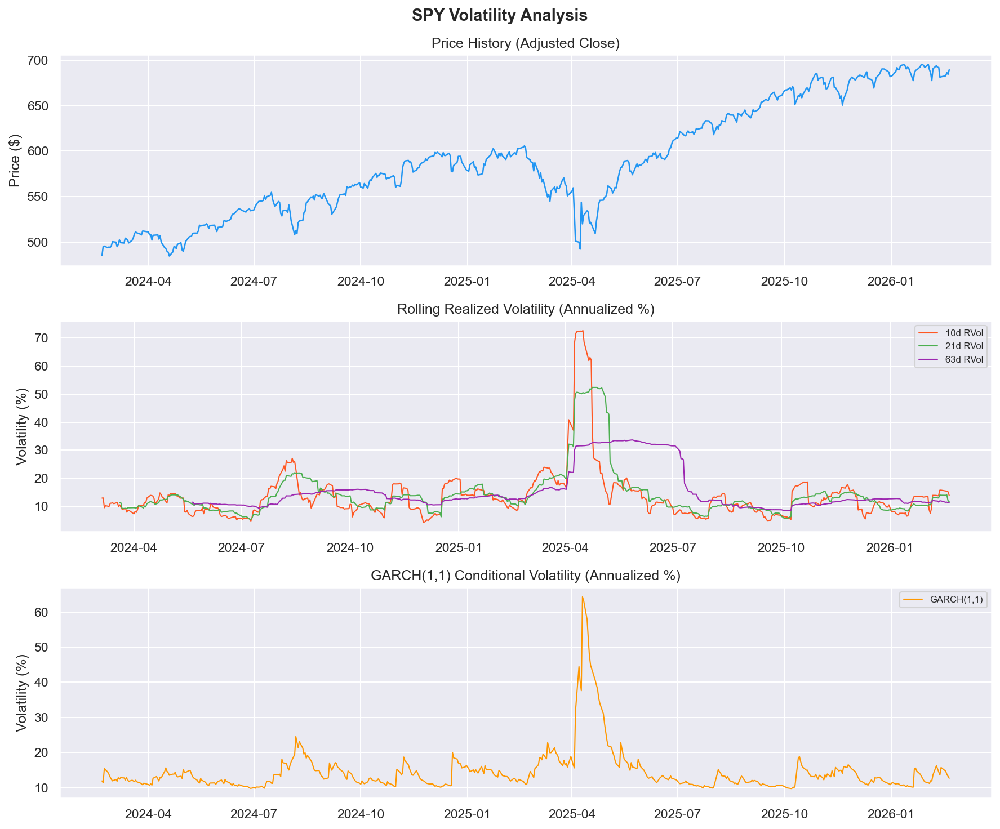

# spy-volatility-pipeline

**Production-grade SPY options volatility pipeline.** Runs daily after market close — ingests price and options data, runs 8 automated quality checks, fits GARCH(1,1), constructs the IV surface, computes the Volatility Risk Premium, and sends email alerts on anomalies.

---

## Latest Run — Feb 20, 2026 · Completed in 3.7s

| Metric | Value |
|---|---|
| Price rows ingested | 502 (2-year history) |
| Options contracts | 969 across 5 expirations |
| 10d Realized Vol | 13.91% |
| 21d Realized Vol | 11.66% |
| 63d Realized Vol | 11.28% |
| GARCH(1,1) Persistence | 0.932 |
| GARCH Long-run Vol | 14.86% |
| Near-term ATM IV | 49.63% |
| **VRP (IV − RVol)** | **+37.97% ⚠ (options rich)** |
| Data quality anomalies | 70 flagged (4 price spikes, 61 wide spreads, 5 IV outliers) |
| Pipeline runtime | 3.7 seconds |

> The 4 price spikes are the April 2025 tariff shock event (−4.93%, −5.85%, +10.50%, −4.38%) — confirmed real, not data errors.

---

## Charts




---

## What it does

Three stages run in sequence every weekday at 4:15 PM:

**1. ETL** — pulls 2 years of SPY daily price history and the nearest 5 options expiration dates from yfinance, upserts everything into SQLite with full audit logging.

**2. Validation** — runs 8 automated data quality checks: price spike detection (z-score), zero/negative prices, OHLC consistency, date gaps, bid-ask inversions, wide spreads, IV outliers, and data freshness. Flags anomalies and optionally emails a report.

**3. Analysis** — computes rolling realized volatility (10d/21d/63d), fits GARCH(1,1) for conditional vol forecasting, runs ADF-style mean-reversion tests with Ornstein-Uhlenbeck half-life, constructs the IV surface (moneyness × expiration), and calculates the Volatility Risk Premium. Saves charts and writes all results to the database.

---

## Project structure

```
spy-volatility-pipeline/
├── config.py           ← All settings: ticker, thresholds, email, schedule time
├── run_pipeline.py     ← Master orchestrator — run this manually or via scheduler
├── scheduler.py        ← Runs in background, triggers pipeline daily at market close
├── requirements.txt
├── src/
│   ├── etl.py          ← Ingests SPY price history + options chain → SQLite
│   ├── validate.py     ← 8 automated data quality checks
│   ├── analyze.py      ← Realized vol, GARCH(1,1), IV surface, VRP, charts
│   └── notifier.py     ← Email alerts on failures / anomalies / VRP spikes
├── docs/               ← Charts committed here for README display
└── outputs/            ← Live chart output (gitignored, regenerated each run)
```

---

## Quickstart

```bash
# 1. Install dependencies
pip install -r requirements.txt

# 2. Run the full pipeline once
python run_pipeline.py

# 3. Start the daily scheduler (fires automatically Mon–Fri at 4:15 PM local time)
python scheduler.py
```

---

## Configuration

Edit `config.py` — no other file needs to change.

| Setting | Default | Description |
|---|---|---|
| `TICKER` | `"SPY"` | Asset to track |
| `PRICE_PERIOD` | `"2y"` | Price history window |
| `MAX_EXPIRATIONS` | `5` | Options expiry dates to pull |
| `SCHEDULE_TIME` | `"16:15"` | Daily run time (local, 24h format) |
| `ZSCORE_SPIKE_THRESHOLD` | `4.0` | Flag daily returns beyond this z-score |
| `MAX_BID_ASK_SPREAD_PCT` | `0.50` | Flag spreads wider than 50% of mid |
| `ALERT_VRP_THRESHOLD` | `0.20` | Alert if VRP exceeds ±20% |
| `ALERT_EMAIL` | `""` | Your email — leave blank to disable |

---

## Email alerts

Fill in 4 lines in `config.py` to enable:

```python
ALERT_EMAIL   = "you@gmail.com"
SMTP_USER     = "you@gmail.com"
SMTP_PASSWORD = "your-app-password"   # Gmail App Password, not your login
ALERT_FROM    = "you@gmail.com"
```

The pipeline alerts you when:
- Any stage crashes (with full error message)
- Validation finds data quality issues
- Price data goes stale (> 5 days)
- VRP exceeds the alert threshold
- Every successful run (daily digest)

---

## Running individual stages

```bash
python run_pipeline.py            # full run: ETL → validate → analyze
python run_pipeline.py --etl-only # ingest only, skip analysis
python run_pipeline.py --no-email # full run, suppress alerts this time

python src/etl.py                 # ETL stage standalone
python src/validate.py            # validation standalone
python src/analyze.py             # analysis standalone
```

---

## Database schema

| Table | Contents |
|---|---|
| `price_history` | Daily OHLCV for SPY, upserted each run |
| `options_chain` | Full options chain per ingestion |
| `analysis_results` | Time series of all computed metrics (rvol, GARCH params, VRP) |
| `etl_log` | Audit log of every ETL event with row counts and status |

---

## Key findings — Feb 20, 2026

The VRP of **+37.97%** is unusually large. Near-term ATM implied vol is pricing in ~49.6% annualized volatility while SPY has only realized 11.66% over the past 21 days. This is consistent with lingering fear premium following the April 2025 tariff shock, which spiked 10-day realized vol above 70% before mean-reverting. The GARCH model's persistence of 0.932 confirms that vol shocks decay slowly — the market remembers April.

The IV surface shows the classic volatility skew: deep OTM puts (moneyness 0.80–0.85) carry 80–150% implied vol, while ATM options sit around 13–25% depending on expiration. Term structure is downward sloping — near-term uncertainty is priced higher than longer-dated risk.
